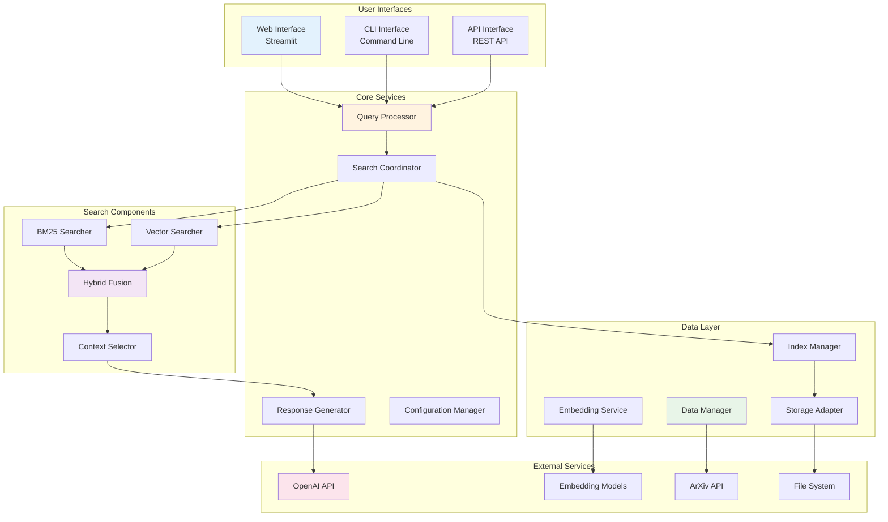

# Component Interactions

This document describes how the various components of the Research Assistant system interact with each other, including their interfaces, dependencies, and communication patterns.

## System Architecture Overview

The Research Assistant is built with a modular architecture where components communicate through well-defined interfaces. This design promotes maintainability, testability, and scalability.



## Core Component Interfaces

### 1. Query Processor Interface

The Query Processor is the central orchestrator that handles all incoming queries and coordinates the response generation process.

```python
class QueryProcessor:
    """Central query processing and coordination component."""
    
    def __init__(self, config: Config):
        self.config = config
        self.search_coordinator = SearchCoordinator(config)
        self.response_generator = ResponseGenerator(config)
        self.query_preprocessor = QueryPreprocessor()
        self.metrics_collector = MetricsCollector()
    
    async def process_query(self, 
                          query: str, 
                          filters: Optional[Dict] = None,
                          options: Optional[QueryOptions] = None) -> QueryResponse:
        """
        Main query processing pipeline.
        
        Args:
            query: User's research query
            filters: Optional search filters (date, category, etc.)
            options: Query processing options
            
        Returns:
            QueryResponse containing answer and metadata
        """
        start_time = time.time()
        
        try:
            # Preprocess query
            processed_query = await self.query_preprocessor.process(query)
            
            # Execute search
            search_results = await self.search_coordinator.search(
                processed_query, filters, options
            )
            
            # Generate response
            response = await self.response_generator.generate(
                query, search_results, options
            )
            
            # Collect metrics
            processing_time = time.time() - start_time
            await self.metrics_collector.record_query(
                query, response, processing_time
            )
            
            return response
            
        except Exception as e:
            return self._handle_error(query, e, time.time() - start_time)
```

### 2. Search Coordinator Interface

The Search Coordinator manages the hybrid search process and result fusion.

```python
class SearchCoordinator:
    """Coordinates hybrid search execution and result fusion."""
    
    def __init__(self, config: Config):
        self.bm25_searcher = BM25Searcher(config.bm25_config)
        self.vector_searcher = VectorSearcher(config.vector_config)
        self.fusion_engine = FusionEngine(config.fusion_config)
        self.context_selector = ContextSelector(config.context_config)
    
    async def search(self, 
                    processed_query: ProcessedQuery,
                    filters: Optional[Dict] = None,
                    options: Optional[QueryOptions] = None) -> SearchResults:
        """
        Execute hybrid search and return ranked results.
        
        Args:
            processed_query: Preprocessed query with metadata
            filters: Search filters to apply
            options: Search options and parameters
            
        Returns:
            SearchResults with ranked documents and metadata
        """
        # Execute searches in parallel
        bm25_task = asyncio.create_task(
            self.bm25_searcher.search(processed_query, filters, options)
        )
        vector_task = asyncio.create_task(
            self.vector_searcher.search(processed_query, filters, options)
        )
        
        bm25_results, vector_results = await asyncio.gather(
            bm25_task, vector_task
        )
        
        # Fuse results
        fused_results = await self.fusion_engine.fuse(
            bm25_results, vector_results, processed_query
        )
        
        # Select context
        selected_context = await self.context_selector.select(
            fused_results, processed_query, options
        )
        
        return SearchResults(
            ranked_documents=fused_results,
            selected_context=selected_context,
            search_metadata=self._create_metadata(
                bm25_results, vector_results, fused_results
            )
        )
```

### 3. Response Generator Interface

The Response Generator creates the final answer using LLM services.

```python
class ResponseGenerator:
    """Generates responses using LLM services and retrieved context."""
    
    def __init__(self, config: Config):
        self.llm_service = LLMService(config.llm_config)
        self.prompt_builder = PromptBuilder(config.prompt_config)
        self.citation_formatter = CitationFormatter()
        self.response_validator = ResponseValidator()
    
    async def generate(self, 
                      original_query: str,
                      search_results: SearchResults,
                      options: Optional[QueryOptions] = None) -> QueryResponse:
        """
        Generate response using LLM and search results.
        
        Args:
            original_query: User's original query
            search_results: Results from search coordinator
            options: Generation options
            
        Returns:
            QueryResponse with answer and citations
        """
        # Build prompt
        prompt_data = await self.prompt_builder.build(
            original_query, search_results.selected_context, options
        )
        
        # Generate response
        llm_response = await self.llm_service.generate(prompt_data)
        
        # Format citations
        formatted_response = await self.citation_formatter.format(
            llm_response, search_results.selected_context
        )
        
        # Validate response
        validation_result = await self.response_validator.validate(
            formatted_response, original_query, search_results
        )
        
        return QueryResponse(
            answer=formatted_response.answer,
            citations=formatted_response.citations,
            confidence_score=validation_result.confidence,
            sources=search_results.selected_context,
            metadata=self._create_response_metadata(
                llm_response, search_results, validation_result
            )
        )
```

## Data Component Interactions

### 1. Data Manager Interface

The Data Manager handles all data ingestion and processing operations.

```python
class DataManager:
    """Manages data ingestion, processing, and storage operations."""
    
    def __init__(self, config: Config):
        self.storage_adapter = StorageAdapter(config.storage_config)
        self.text_processor = TextProcessor(config.processing_config)
        self.embedding_service = EmbeddingService(config.embedding_config)
        self.index_manager = IndexManager(config.index_config)
    
    async def ingest_papers(self, paper_sources: List[str]) -> IngestionResult:
        """
        Ingest papers from various sources and update indices.
        
        Args:
            paper_sources: List of paper sources (URLs, files, etc.)
            
        Returns:
            IngestionResult with processing statistics
        """
        ingestion_stats = IngestionStats()
        
        for source in paper_sources:
            try:
                # Extract paper data
                paper_data = await self._extract_paper_data(source)
                
                # Process text
                processed_data = await self.text_processor.process(paper_data)
                
                # Generate embeddings
                embeddings = await self.embedding_service.generate_embeddings(
                    processed_data.chunks
                )
                
                # Store data
                await self.storage_adapter.store_paper(
                    processed_data, embeddings
                )
                
                # Update indices
                await self.index_manager.update_indices(
                    processed_data, embeddings
                )
                
                ingestion_stats.record_success(source)
                
            except Exception as e:
                ingestion_stats.record_error(source, e)
                
        return IngestionResult(
            total_processed=ingestion_stats.total,
            successful=ingestion_stats.successful,
            failed=ingestion_stats.failed,
            errors=ingestion_stats.errors
        )
    
    async def update_paper(self, paper_id: str, updated_data: Dict) -> bool:
        """Update existing paper data and refresh indices."""
        try:
            # Update stored data
            await self.storage_adapter.update_paper(paper_id, updated_data)
            
            # Refresh indices
            await self.index_manager.refresh_paper_indices(paper_id)
            
            return True
        except Exception as e:
            logger.error(f"Failed to update paper {paper_id}: {e}")
            return False
```

### 2. Index Manager Interface

The Index Manager handles search index operations and maintenance.

```python
class IndexManager:
    """Manages search indices and their lifecycle."""
    
    def __init__(self, config: Config):
        self.bm25_index = BM25Index(config.bm25_index_config)
        self.vector_index = VectorIndex(config.vector_index_config)
        self.metadata_index = MetadataIndex(config.metadata_config)
        self.index_stats = IndexStatistics()
    
    async def update_indices(self, 
                           processed_data: ProcessedPaperData,
                           embeddings: List[np.ndarray]) -> None:
        """
        Update all indices with new paper data.
        
        Args:
            processed_data: Processed paper text and metadata
            embeddings: Generated embeddings for text chunks
        """
        # Update BM25 index
        await self.bm25_index.add_document(
            processed_data.paper_id,
            processed_data.chunks,
            processed_data.metadata
        )
        
        # Update vector index
        await self.vector_index.add_embeddings(
            processed_data.paper_id,
            embeddings,
            processed_data.chunk_metadata
        )
        
        # Update metadata index
        await self.metadata_index.add_paper(
            processed_data.paper_id,
            processed_data.metadata
        )
        
        # Update statistics
        self.index_stats.record_addition(processed_data.paper_id)
    
    async def rebuild_indices(self) -> IndexRebuildResult:
        """Rebuild all indices from stored data."""
        try:
            # Get all stored papers
            all_papers = await self.storage_adapter.get_all_papers()
            
            # Clear existing indices
            await self._clear_all_indices()
            
            # Rebuild each index
            rebuild_stats = IndexRebuildStats()
            
            for paper in all_papers:
                await self.update_indices(paper.processed_data, paper.embeddings)
                rebuild_stats.record_processed(paper.paper_id)
            
            return IndexRebuildResult(
                success=True,
                papers_processed=rebuild_stats.total_processed,
                time_taken=rebuild_stats.total_time
            )
            
        except Exception as e:
            return IndexRebuildResult(
                success=False,
                error=str(e)
            )
```

## Service Communication Patterns

### 1. Synchronous Communication

For operations requiring immediate responses:

```python
class SynchronousService:
    """Example of synchronous service communication."""
    
    def __init__(self, dependency_service: DependencyService):
        self.dependency = dependency_service
    
    def process_request(self, request: Request) -> Response:
        # Direct synchronous call
        intermediate_result = self.dependency.process(request.data)
        
        # Process the result
        final_result = self._transform_result(intermediate_result)
        
        return Response(data=final_result)
```

### 2. Asynchronous Communication

For long-running or parallel operations:

```python
class AsynchronousService:
    """Example of asynchronous service communication."""
    
    def __init__(self, multiple_services: List[Service]):
        self.services = multiple_services
    
    async def process_request(self, request: Request) -> Response:
        # Create tasks for parallel execution
        tasks = [
            asyncio.create_task(service.process_async(request))
            for service in self.services
        ]
        
        # Wait for all tasks to complete
        results = await asyncio.gather(*tasks, return_exceptions=True)
        
        # Combine results
        combined_result = self._combine_results(results)
        
        return Response(data=combined_result)
```

### 3. Event-Driven Communication

For loose coupling and scalability:

```python
class EventBus:
    """Simple event bus for component communication."""
    
    def __init__(self):
        self.subscribers = defaultdict(list)
    
    def subscribe(self, event_type: str, handler: Callable):
        """Subscribe to events of a specific type."""
        self.subscribers[event_type].append(handler)
    
    async def publish(self, event: Event):
        """Publish an event to all subscribers."""
        handlers = self.subscribers.get(event.type, [])
        
        if handlers:
            tasks = [
                asyncio.create_task(handler(event))
                for handler in handlers
            ]
            await asyncio.gather(*tasks, return_exceptions=True)

# Usage example
class DataIngestionService:
    def __init__(self, event_bus: EventBus):
        self.event_bus = event_bus
    
    async def ingest_paper(self, paper_data: PaperData):
        # Process the paper
        processed_data = await self._process_paper(paper_data)
        
        # Publish event
        await self.event_bus.publish(
            Event(
                type="paper_ingested",
                data={
                    "paper_id": processed_data.id,
                    "metadata": processed_data.metadata
                }
            )
        )

class IndexUpdateService:
    def __init__(self, event_bus: EventBus):
        self.event_bus = event_bus
        # Subscribe to paper ingestion events
        self.event_bus.subscribe("paper_ingested", self.handle_paper_ingested)
    
    async def handle_paper_ingested(self, event: Event):
        """Handle paper ingestion event by updating indices."""
        paper_id = event.data["paper_id"]
        await self.update_indices_for_paper(paper_id)
```

## Error Handling and Recovery

### 1. Component-Level Error Handling

Each component implements robust error handling:

```python
class ResilientComponent:
    """Example component with comprehensive error handling."""
    
    def __init__(self, config: Config):
        self.config = config
        self.circuit_breaker = CircuitBreaker(
            failure_threshold=5,
            recovery_timeout=30
        )
        self.retry_policy = RetryPolicy(
            max_attempts=3,
            backoff_strategy="exponential"
        )
    
    async def process_with_resilience(self, data: Any) -> Result:
        """Process data with error handling and resilience patterns."""
        
        # Circuit breaker pattern
        if self.circuit_breaker.is_open():
            return self._fallback_response(data)
        
        # Retry pattern
        for attempt in range(self.retry_policy.max_attempts):
            try:
                result = await self._process_data(data)
                self.circuit_breaker.record_success()
                return result
                
            except RetryableError as e:
                if attempt < self.retry_policy.max_attempts - 1:
                    wait_time = self.retry_policy.calculate_wait_time(attempt)
                    await asyncio.sleep(wait_time)
                    continue
                else:
                    self.circuit_breaker.record_failure()
                    raise
                    
            except NonRetryableError as e:
                self.circuit_breaker.record_failure()
                return self._handle_non_retryable_error(e, data)
```

### 2. System-Level Error Recovery

Coordinated error recovery across components:

```python
class SystemRecoveryManager:
    """Manages system-wide error recovery procedures."""
    
    def __init__(self, components: Dict[str, Component]):
        self.components = components
        self.health_checker = HealthChecker(components)
        self.recovery_procedures = RecoveryProcedures()
    
    async def monitor_system_health(self):
        """Continuously monitor system health and trigger recovery."""
        while True:
            health_status = await self.health_checker.check_all_components()
            
            for component_name, status in health_status.items():
                if status.is_unhealthy():
                    await self._handle_unhealthy_component(
                        component_name, status
                    )
            
            await asyncio.sleep(30)  # Check every 30 seconds
    
    async def _handle_unhealthy_component(self, 
                                        component_name: str, 
                                        status: HealthStatus):
        """Handle unhealthy component by triggering recovery."""
        
        recovery_procedure = self.recovery_procedures.get(component_name)
        
        if recovery_procedure:
            try:
                await recovery_procedure.execute(self.components[component_name])
                logger.info(f"Successfully recovered {component_name}")
                
            except Exception as e:
                logger.error(f"Failed to recover {component_name}: {e}")
                await self._escalate_recovery_failure(component_name, e)
```

## Performance Monitoring

### 1. Component Performance Metrics

Each component reports performance metrics:

```python
class PerformanceMonitor:
    """Monitors and reports component performance metrics."""
    
    def __init__(self):
        self.metrics_store = MetricsStore()
        self.alert_manager = AlertManager()
    
    def record_operation(self, 
                        component: str, 
                        operation: str, 
                        duration: float,
                        success: bool,
                        metadata: Dict = None):
        """Record operation metrics."""
        
        metric = OperationMetric(
            component=component,
            operation=operation,
            duration=duration,
            success=success,
            timestamp=datetime.now(),
            metadata=metadata or {}
        )
        
        self.metrics_store.store(metric)
        
        # Check for performance issues
        if duration > self._get_threshold(component, operation):
            self.alert_manager.send_alert(
                f"Slow operation detected: {component}.{operation} "
                f"took {duration:.2f}s"
            )
    
    def get_performance_summary(self, 
                              component: str, 
                              time_window: timedelta) -> PerformanceSummary:
        """Get performance summary for a component."""
        
        metrics = self.metrics_store.get_metrics(
            component=component,
            since=datetime.now() - time_window
        )
        
        return PerformanceSummary(
            component=component,
            total_operations=len(metrics),
            avg_duration=np.mean([m.duration for m in metrics]),
            success_rate=np.mean([m.success for m in metrics]),
            p95_duration=np.percentile([m.duration for m in metrics], 95),
            error_count=sum(1 for m in metrics if not m.success)
        )
```

### 2. Inter-Component Communication Monitoring

Monitor communication between components:

```python
class CommunicationMonitor:
    """Monitors inter-component communication patterns."""
    
    def __init__(self):
        self.communication_graph = nx.DiGraph()
        self.interaction_metrics = defaultdict(list)
    
    def record_interaction(self, 
                          source: str, 
                          target: str, 
                          operation: str,
                          duration: float,
                          payload_size: int):
        """Record interaction between components."""
        
        # Update communication graph
        if not self.communication_graph.has_edge(source, target):
            self.communication_graph.add_edge(source, target, weight=0)
        
        self.communication_graph[source][target]['weight'] += 1
        
        # Record metrics
        self.interaction_metrics[(source, target)].append({
            'operation': operation,
            'duration': duration,
            'payload_size': payload_size,
            'timestamp': datetime.now()
        })
    
    def analyze_communication_patterns(self) -> CommunicationAnalysis:
        """Analyze communication patterns and identify bottlenecks."""
        
        # Find most frequent communication paths
        frequent_paths = sorted(
            [(u, v, data['weight']) for u, v, data in self.communication_graph.edges(data=True)],
            key=lambda x: x[2],
            reverse=True
        )
        
        # Identify bottlenecks
        bottlenecks = []
        for (source, target), interactions in self.interaction_metrics.items():
            avg_duration = np.mean([i['duration'] for i in interactions])
            if avg_duration > 1.0:  # Threshold for slow interactions
                bottlenecks.append((source, target, avg_duration))
        
        return CommunicationAnalysis(
            frequent_paths=frequent_paths[:10],
            bottlenecks=bottlenecks,
            total_interactions=sum(
                len(interactions) for interactions in self.interaction_metrics.values()
            )
        )
```

## Configuration Management

### 1. Component Configuration

Centralized configuration management:

```python
class ConfigurationManager:
    """Manages configuration for all system components."""
    
    def __init__(self, config_file: str):
        self.config_data = self._load_config(config_file)
        self.component_configs = self._parse_component_configs()
        self.config_watchers = []
    
    def get_component_config(self, component_name: str) -> ComponentConfig:
        """Get configuration for a specific component."""
        
        if component_name not in self.component_configs:
            raise ConfigurationError(f"No configuration found for {component_name}")
        
        return self.component_configs[component_name]
    
    def update_component_config(self, 
                              component_name: str, 
                              new_config: Dict):
        """Update configuration for a component."""
        
        self.component_configs[component_name].update(new_config)
        
        # Notify watchers
        for watcher in self.config_watchers:
            if watcher.component == component_name:
                asyncio.create_task(watcher.on_config_change(new_config))
    
    def watch_config_changes(self, component_name: str, callback: Callable):
        """Watch for configuration changes."""
        
        watcher = ConfigWatcher(component=component_name, callback=callback)
        self.config_watchers.append(watcher)
```

### 2. Dynamic Configuration Updates

Support for runtime configuration updates:

```python
class DynamicComponent:
    """Component that supports dynamic configuration updates."""
    
    def __init__(self, config: ComponentConfig, config_manager: ConfigurationManager):
        self.config = config
        self.config_manager = config_manager
        
        # Watch for configuration changes
        self.config_manager.watch_config_changes(
            self.__class__.__name__,
            self._on_config_change
        )
    
    async def _on_config_change(self, new_config: Dict):
        """Handle configuration changes."""
        
        try:
            # Validate new configuration
            validated_config = self._validate_config(new_config)
            
            # Apply configuration changes
            await self._apply_config_changes(validated_config)
            
            # Update internal configuration
            self.config.update(validated_config)
            
            logger.info(f"Configuration updated for {self.__class__.__name__}")
            
        except Exception as e:
            logger.error(f"Failed to update configuration: {e}")
            # Keep using old configuration
```

This comprehensive component interaction documentation provides the foundation for understanding how the Research Assistant's components work together to deliver a robust and scalable research assistance system.
