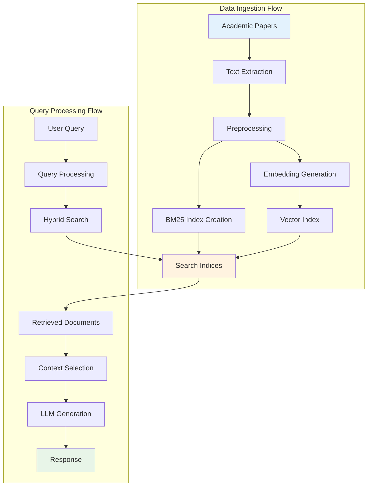

# Data Flow

This document describes how data flows through the Research Assistant system, from initial paper ingestion to final query responses. Understanding these data flows is crucial for system maintenance, debugging, and optimization.

## Overview

The Research Assistant processes two main types of data flows:
1. **Ingestion Flow**: Academic papers → Processed data → Search indices
2. **Query Flow**: User queries → Retrieved contexts → Generated responses



## 1. Data Ingestion Flow

### Academic Paper Sources

The system ingests academic papers from multiple sources:

#### ArXiv Integration
```python
# arxiv_collector.py
class ArxivCollector:
    def collect_papers(self, query, max_results=1000):
        papers = []
        for paper in arxiv.Search(
            query=query,
            max_results=max_results,
            sort_by=arxiv.SortCriterion.SubmittedDate
        ).results():
            paper_data = {
                'id': paper.entry_id,
                'title': paper.title,
                'authors': [str(author) for author in paper.authors],
                'abstract': paper.summary,
                'published': paper.published,
                'pdf_url': paper.pdf_url,
                'categories': paper.categories
            }
            papers.append(paper_data)
        return papers
```

#### Data Structure
```json
{
  "id": "2301.12345",
  "title": "Advanced Machine Learning Techniques",
  "authors": ["John Doe", "Jane Smith"],
  "abstract": "This paper presents...",
  "published": "2023-01-15T10:30:00Z",
  "pdf_url": "https://arxiv.org/pdf/2301.12345.pdf",
  "categories": ["cs.LG", "stat.ML"],
  "full_text": "extracted_text_content",
  "sections": {
    "introduction": "...",
    "methodology": "...",
    "results": "...",
    "conclusion": "..."
  }
}
```

### Text Processing Pipeline

#### 1. PDF Text Extraction
```python
class PDFProcessor:
    def extract_text(self, pdf_url):
        response = requests.get(pdf_url)
        with tempfile.NamedTemporaryFile(suffix='.pdf') as tmp_file:
            tmp_file.write(response.content)
            tmp_file.flush()
            
            text = ""
            with open(tmp_file.name, 'rb') as file:
                pdf_reader = PyPDF2.PdfReader(file)
                for page in pdf_reader.pages:
                    text += page.extract_text()
            
            return self.clean_text(text)
```

#### 2. Text Preprocessing
- **Cleaning**: Remove formatting artifacts, fix encoding issues
- **Normalization**: Standardize whitespace, handle special characters
- **Section detection**: Identify paper structure (abstract, introduction, etc.)
- **Citation extraction**: Parse and normalize citations

```python
class TextPreprocessor:
    def process(self, raw_text):
        # Clean and normalize text
        cleaned = self.clean_text(raw_text)
        
        # Detect sections
        sections = self.detect_sections(cleaned)
        
        # Extract citations
        citations = self.extract_citations(cleaned)
        
        # Create chunks for indexing
        chunks = self.create_chunks(cleaned, chunk_size=512, overlap=50)
        
        return {
            'full_text': cleaned,
            'sections': sections,
            'citations': citations,
            'chunks': chunks
        }
```

#### 3. Chunking Strategy
Documents are split into overlapping chunks for better retrieval:

```python
def create_chunks(text, chunk_size=512, overlap=50):
    sentences = sent_tokenize(text)
    chunks = []
    current_chunk = []
    current_length = 0
    
    for sentence in sentences:
        sentence_length = len(sentence.split())
        
        if current_length + sentence_length > chunk_size and current_chunk:
            # Create chunk with overlap
            chunk_text = ' '.join(current_chunk)
            chunks.append(chunk_text)
            
            # Keep last few sentences for overlap
            overlap_sentences = current_chunk[-overlap:]
            current_chunk = overlap_sentences + [sentence]
            current_length = sum(len(s.split()) for s in current_chunk)
        else:
            current_chunk.append(sentence)
            current_length += sentence_length
    
    if current_chunk:
        chunks.append(' '.join(current_chunk))
    
    return chunks
```

### Index Creation

#### BM25 Index Building
```python
class BM25IndexBuilder:
    def __init__(self, k1=1.2, b=0.75):
        self.k1 = k1
        self.b = b
        self.tokenizer = self.setup_tokenizer()
    
    def build_index(self, documents):
        # Tokenize all documents
        tokenized_docs = []
        for doc in documents:
            tokens = self.tokenize(doc['text'])
            tokenized_docs.append(tokens)
        
        # Calculate document statistics
        doc_lengths = [len(tokens) for tokens in tokenized_docs]
        avg_doc_length = sum(doc_lengths) / len(doc_lengths)
        
        # Build inverted index
        inverted_index = defaultdict(list)
        for doc_id, tokens in enumerate(tokenized_docs):
            token_counts = Counter(tokens)
            for token, count in token_counts.items():
                inverted_index[token].append((doc_id, count))
        
        # Calculate IDF scores
        idf_scores = {}
        for term, postings in inverted_index.items():
            df = len(postings)  # Document frequency
            idf = math.log((len(documents) - df + 0.5) / (df + 0.5))
            idf_scores[term] = max(idf, 0.01)  # Avoid negative IDF
        
        return {
            'inverted_index': inverted_index,
            'idf_scores': idf_scores,
            'doc_lengths': doc_lengths,
            'avg_doc_length': avg_doc_length,
            'documents': documents
        }
```

#### Vector Index Building
```python
class VectorIndexBuilder:
    def __init__(self, model_name="sentence-transformers/all-MiniLM-L6-v2"):
        self.model = SentenceTransformer(model_name)
        self.dimension = self.model.get_sentence_embedding_dimension()
    
    def build_index(self, documents):
        # Extract text chunks
        texts = []
        doc_metadata = []
        
        for doc in documents:
            for chunk_id, chunk in enumerate(doc['chunks']):
                texts.append(chunk)
                doc_metadata.append({
                    'doc_id': doc['id'],
                    'chunk_id': chunk_id,
                    'title': doc['title'],
                    'authors': doc['authors']
                })
        
        # Generate embeddings in batches
        batch_size = 32
        embeddings = []
        
        for i in range(0, len(texts), batch_size):
            batch_texts = texts[i:i + batch_size]
            batch_embeddings = self.model.encode(
                batch_texts,
                show_progress_bar=True,
                convert_to_numpy=True
            )
            embeddings.extend(batch_embeddings)
        
        # Build FAISS index
        embeddings_array = np.array(embeddings).astype('float32')
        index = faiss.IndexHNSWFlat(self.dimension, 32)
        index.add(embeddings_array)
        
        return {
            'index': index,
            'embeddings': embeddings_array,
            'metadata': doc_metadata,
            'texts': texts
        }
```

### Data Storage

#### File System Structure
```
data/
├── raw/                    # Original paper data
│   ├── arxiv_papers.json
│   └── pdf_cache/
├── processed/              # Cleaned and processed data
│   ├── processed_papers.json
│   └── chunks.json
├── indices/               # Search indices
│   ├── bm25_index.pkl
│   ├── vector_index.faiss
│   └── metadata.json
└── embeddings/            # Cached embeddings
    ├── paper_embeddings.npy
    └── embedding_metadata.json
```

#### Database Schema (SQLite)
```sql
-- Papers table
CREATE TABLE papers (
    id TEXT PRIMARY KEY,
    title TEXT NOT NULL,
    authors TEXT,  -- JSON array
    abstract TEXT,
    published DATE,
    categories TEXT,  -- JSON array
    pdf_url TEXT,
    full_text TEXT,
    created_at TIMESTAMP DEFAULT CURRENT_TIMESTAMP
);

-- Chunks table for retrieval
CREATE TABLE chunks (
    id INTEGER PRIMARY KEY AUTOINCREMENT,
    paper_id TEXT,
    chunk_index INTEGER,
    text TEXT NOT NULL,
    section TEXT,
    embedding_vector BLOB,  -- Serialized numpy array
    FOREIGN KEY (paper_id) REFERENCES papers(id)
);

-- Search index metadata
CREATE TABLE index_metadata (
    key TEXT PRIMARY KEY,
    value TEXT,
    updated_at TIMESTAMP DEFAULT CURRENT_TIMESTAMP
);
```

## 2. Query Processing Flow

### Query Input Processing

#### Query Normalization
```python
class QueryProcessor:
    def __init__(self):
        self.nlp = spacy.load("en_core_web_sm")
        self.spell_checker = SpellChecker()
    
    def process_query(self, raw_query):
        # Basic cleaning
        query = raw_query.strip().lower()
        
        # Spell correction
        corrected_words = []
        for word in query.split():
            if word in self.spell_checker:
                corrected_words.append(word)
            else:
                correction = self.spell_checker.correction(word)
                corrected_words.append(correction or word)
        
        corrected_query = ' '.join(corrected_words)
        
        # Extract entities and keywords
        doc = self.nlp(corrected_query)
        entities = [(ent.text, ent.label_) for ent in doc.ents]
        keywords = [token.lemma_ for token in doc if token.is_alpha and not token.is_stop]
        
        return {
            'original': raw_query,
            'processed': corrected_query,
            'entities': entities,
            'keywords': keywords
        }
```

#### Query Expansion
```python
class QueryExpander:
    def __init__(self):
        self.synonyms = self.load_synonyms()
        self.acronym_dict = self.load_acronyms()
    
    def expand_query(self, processed_query):
        expanded_terms = []
        
        for term in processed_query['keywords']:
            expanded_terms.append(term)
            
            # Add synonyms
            if term in self.synonyms:
                expanded_terms.extend(self.synonyms[term])
            
            # Expand acronyms
            if term.upper() in self.acronym_dict:
                expanded_terms.append(self.acronym_dict[term.upper()])
        
        # Remove duplicates while preserving order
        unique_terms = list(dict.fromkeys(expanded_terms))
        
        return {
            'original_terms': processed_query['keywords'],
            'expanded_terms': unique_terms,
            'expansion_query': ' '.join(unique_terms)
        }
```

### Search Execution

#### Parallel Search Processing
```python
class SearchCoordinator:
    def __init__(self, bm25_index, vector_index):
        self.bm25_searcher = BM25Searcher(bm25_index)
        self.vector_searcher = VectorSearcher(vector_index)
        self.executor = ThreadPoolExecutor(max_workers=2)
    
    def search(self, query, top_k=20):
        # Execute searches in parallel
        bm25_future = self.executor.submit(
            self.bm25_searcher.search, query, top_k
        )
        vector_future = self.executor.submit(
            self.vector_searcher.search, query, top_k
        )
        
        # Collect results
        bm25_results = bm25_future.result()
        vector_results = vector_future.result()
        
        # Log search statistics
        self.log_search_stats(query, bm25_results, vector_results)
        
        return {
            'bm25_results': bm25_results,
            'vector_results': vector_results,
            'query_metadata': {
                'processed_query': query,
                'timestamp': datetime.now(),
                'result_counts': {
                    'bm25': len(bm25_results),
                    'vector': len(vector_results)
                }
            }
        }
```

### Result Fusion and Ranking

#### Score Normalization
```python
def normalize_scores(results, method='min_max'):
    """Normalize scores to [0, 1] range"""
    scores = [score for _, score in results]
    
    if method == 'min_max':
        min_score, max_score = min(scores), max(scores)
        if max_score == min_score:
            return [(doc_id, 1.0) for doc_id, _ in results]
        
        normalized = []
        for doc_id, score in results:
            norm_score = (score - min_score) / (max_score - min_score)
            normalized.append((doc_id, norm_score))
        return normalized
    
    elif method == 'z_score':
        mean_score = np.mean(scores)
        std_score = np.std(scores)
        if std_score == 0:
            return [(doc_id, 0.5) for doc_id, _ in results]
        
        normalized = []
        for doc_id, score in results:
            z_score = (score - mean_score) / std_score
            norm_score = 1 / (1 + np.exp(-z_score))  # Sigmoid normalization
            normalized.append((doc_id, norm_score))
        return normalized
```

#### Context Selection Pipeline
```python
class ContextSelector:
    def __init__(self, max_context_length=4000, diversity_threshold=0.8):
        self.max_context_length = max_context_length
        self.diversity_threshold = diversity_threshold
        self.similarity_model = SentenceTransformer('all-MiniLM-L6-v2')
    
    def select_context(self, fused_results, query):
        selected_chunks = []
        current_length = 0
        used_papers = set()
        
        for doc_id, score in fused_results:
            chunk_info = self.get_chunk_info(doc_id)
            chunk_text = chunk_info['text']
            
            # Check length constraint
            chunk_length = len(chunk_text.split())
            if current_length + chunk_length > self.max_context_length:
                break
            
            # Check diversity (avoid too many chunks from same paper)
            paper_id = chunk_info['paper_id']
            if paper_id in used_papers:
                paper_chunk_count = sum(1 for c in selected_chunks 
                                      if c['paper_id'] == paper_id)
                if paper_chunk_count >= 3:  # Max 3 chunks per paper
                    continue
            
            # Check semantic diversity
            if self.is_diverse_enough(chunk_text, selected_chunks):
                selected_chunks.append({
                    'text': chunk_text,
                    'paper_id': paper_id,
                    'title': chunk_info['title'],
                    'authors': chunk_info['authors'],
                    'score': score,
                    'chunk_id': doc_id
                })
                current_length += chunk_length
                used_papers.add(paper_id)
        
        return selected_chunks
    
    def is_diverse_enough(self, new_text, existing_chunks):
        if not existing_chunks:
            return True
        
        new_embedding = self.similarity_model.encode([new_text])
        existing_texts = [chunk['text'] for chunk in existing_chunks[-3:]]  # Compare with last 3
        existing_embeddings = self.similarity_model.encode(existing_texts)
        
        similarities = cosine_similarity(new_embedding, existing_embeddings)[0]
        max_similarity = max(similarities) if similarities.size > 0 else 0
        
        return max_similarity < self.diversity_threshold
```

### Response Generation

#### Prompt Construction
```python
class PromptBuilder:
    def __init__(self, template_path="prompts/rag_prompt.txt"):
        with open(template_path, 'r') as f:
            self.template = f.read()
    
    def build_prompt(self, query, context_chunks):
        # Format context
        context_sections = []
        for i, chunk in enumerate(context_chunks, 1):
            context_section = f"""
Source {i}: {chunk['title']} (Authors: {', '.join(chunk['authors'])})
Content: {chunk['text']}
---
"""
            context_sections.append(context_section)
        
        context_text = '\n'.join(context_sections)
        
        # Build full prompt
        prompt = self.template.format(
            query=query,
            context=context_text,
            num_sources=len(context_chunks)
        )
        
        return {
            'prompt': prompt,
            'context_chunks': context_chunks,
            'metadata': {
                'prompt_length': len(prompt),
                'num_sources': len(context_chunks),
                'source_papers': list(set(c['paper_id'] for c in context_chunks))
            }
        }
```

#### LLM Interaction
```python
class LLMService:
    def __init__(self, model="gpt-3.5-turbo", temperature=0.1):
        self.model = model
        self.temperature = temperature
        self.client = openai.OpenAI()
    
    def generate_response(self, prompt_data):
        try:
            response = self.client.chat.completions.create(
                model=self.model,
                messages=[
                    {"role": "system", "content": "You are a helpful research assistant."},
                    {"role": "user", "content": prompt_data['prompt']}
                ],
                temperature=self.temperature,
                max_tokens=1000
            )
            
            generated_text = response.choices[0].message.content
            
            return {
                'response': generated_text,
                'model_info': {
                    'model': self.model,
                    'temperature': self.temperature,
                    'tokens_used': response.usage.total_tokens
                },
                'context_metadata': prompt_data['metadata']
            }
        
        except Exception as e:
            return {
                'error': str(e),
                'fallback_response': self.generate_fallback_response(prompt_data)
            }
```

## Data Flow Monitoring

### Logging Strategy
```python
class DataFlowLogger:
    def __init__(self, log_file="data_flow.log"):
        self.logger = logging.getLogger("DataFlow")
        handler = logging.FileHandler(log_file)
        formatter = logging.Formatter(
            '%(asctime)s - %(name)s - %(levelname)s - %(message)s'
        )
        handler.setFormatter(formatter)
        self.logger.addHandler(handler)
        self.logger.setLevel(logging.INFO)
    
    def log_ingestion(self, papers_processed, processing_time):
        self.logger.info(f"Ingested {papers_processed} papers in {processing_time:.2f}s")
    
    def log_query(self, query, results_count, processing_time):
        self.logger.info(f"Query: '{query}' returned {results_count} results in {processing_time:.2f}s")
    
    def log_error(self, operation, error_msg):
        self.logger.error(f"Error in {operation}: {error_msg}")
```

### Performance Metrics
```python
class PerformanceTracker:
    def __init__(self):
        self.metrics = defaultdict(list)
    
    def track_ingestion(self, papers_count, time_taken):
        self.metrics['ingestion_rate'].append(papers_count / time_taken)
        self.metrics['ingestion_time'].append(time_taken)
    
    def track_query(self, query_length, results_count, time_taken):
        self.metrics['query_response_time'].append(time_taken)
        self.metrics['results_per_query'].append(results_count)
        self.metrics['query_length'].append(query_length)
    
    def get_summary(self):
        return {
            'avg_ingestion_rate': np.mean(self.metrics['ingestion_rate']),
            'avg_response_time': np.mean(self.metrics['query_response_time']),
            'avg_results_count': np.mean(self.metrics['results_per_query'])
        }
```

## Error Handling and Recovery

### Data Ingestion Errors
- **PDF extraction failures**: Retry with alternative extractors
- **Embedding generation errors**: Skip problematic documents
- **Index corruption**: Rebuild indices from processed data
- **Storage errors**: Implement backup and recovery procedures

### Query Processing Errors
- **Search timeouts**: Return partial results with warnings
- **LLM API failures**: Provide fallback responses
- **Context overflow**: Intelligent truncation strategies
- **Malformed queries**: Query correction and suggestions

### Recovery Procedures
```python
class ErrorRecovery:
    def handle_ingestion_error(self, error, paper_data):
        if "PDF extraction" in str(error):
            # Try alternative extraction method
            return self.fallback_extraction(paper_data)
        elif "embedding" in str(error):
            # Skip embedding, use text-only indexing
            return self.text_only_processing(paper_data)
        else:
            # Log and skip this document
            self.log_failed_document(paper_data, error)
            return None
    
    def handle_query_error(self, error, query):
        if "timeout" in str(error):
            return self.partial_results_response(query)
        elif "API" in str(error):
            return self.fallback_response(query)
        else:
            return self.error_response(query, error)
```

This comprehensive data flow documentation provides the foundation for understanding how information moves through the Research Assistant system, enabling effective debugging, optimization, and system maintenance.
