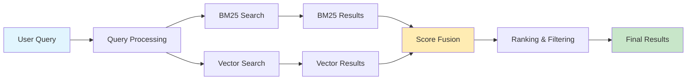

# Hybrid Search

The Research Assistant employs a sophisticated hybrid search system that combines the strengths of both lexical (keyword-based) and semantic (meaning-based) search approaches to deliver highly relevant results for academic research queries.

## Overview

Hybrid search addresses the limitations of individual search methods by leveraging:
- **BM25 (Best Matching 25)**: Excellent for exact term matches and technical terminology
- **Dense Vector Search**: Superior for conceptual similarity and semantic understanding
- **Intelligent Fusion**: Combines results to maximize both precision and recall



## Core Components

### 1. BM25 Lexical Search

BM25 is a probabilistic ranking function that excels at finding documents containing specific terms from the query.

#### Key Features
- **Term frequency normalization**: Prevents long documents from dominating
- **Inverse document frequency**: Prioritizes rare, informative terms
- **Document length normalization**: Balances short vs. long documents
- **Parameter tuning**: Configurable k1 and b parameters for optimization

#### Implementation
```python
class BM25Retriever:
    def __init__(self, corpus, k1=1.2, b=0.75):
        self.k1 = k1  # Term frequency saturation parameter
        self.b = b    # Document length normalization parameter
        self.index = self._build_index(corpus)
    
    def search(self, query, top_k=10):
        query_terms = self.tokenize(query)
        scores = self._calculate_bm25_scores(query_terms)
        return self._get_top_results(scores, top_k)
```

#### Strengths
- Fast retrieval for large document collections
- Excellent performance on technical terminology
- Robust handling of exact phrase matches
- Well-established and interpretable scoring

#### Limitations
- Cannot capture semantic similarity
- Vocabulary mismatch problems
- Poor performance on synonyms and paraphrases
- Limited understanding of query intent

### 2. Dense Vector Search

Vector search uses pre-trained embeddings to find semantically similar content based on meaning rather than exact word matches.

#### Embedding Models
The system supports multiple embedding models optimized for scientific content:

- **SciBERT**: Specialized for scientific literature
- **Sentence-BERT**: General-purpose sentence embeddings
- **E5-large**: High-performance multilingual embeddings
- **Custom domain embeddings**: Fine-tuned for specific research areas

#### Implementation
```python
class VectorRetriever:
    def __init__(self, embedding_model, vector_index):
        self.embedding_model = embedding_model
        self.vector_index = vector_index  # FAISS or similar
    
    def search(self, query, top_k=10):
        query_embedding = self.embedding_model.encode(query)
        similarities, indices = self.vector_index.search(
            query_embedding, top_k
        )
        return self._format_results(similarities, indices)
```

#### Strengths
- Captures semantic relationships and context
- Handles synonyms and paraphrases effectively
- Better performance on conceptual queries
- Language-agnostic similarity matching

#### Limitations
- Computationally expensive for large collections
- Less effective for exact term requirements
- Requires high-quality embedding models
- Can miss important keyword-specific matches

### 3. Fusion Strategies

The hybrid search system combines BM25 and vector search results using sophisticated fusion algorithms.

#### Reciprocal Rank Fusion (RRF)
The primary fusion method used, which combines rankings rather than raw scores:

```python
def reciprocal_rank_fusion(bm25_results, vector_results, k=60):
    """
    Combine two result lists using reciprocal rank fusion
    RRF score = sum(1 / (k + rank_i)) for all result lists
    """
    combined_scores = {}
    
    # Process BM25 results
    for rank, (doc_id, score) in enumerate(bm25_results):
        combined_scores[doc_id] = 1.0 / (k + rank + 1)
    
    # Add vector search results
    for rank, (doc_id, score) in enumerate(vector_results):
        if doc_id in combined_scores:
            combined_scores[doc_id] += 1.0 / (k + rank + 1)
        else:
            combined_scores[doc_id] = 1.0 / (k + rank + 1)
    
    return sorted(combined_scores.items(), key=lambda x: x[1], reverse=True)
```

#### Weighted Score Fusion
Alternative approach that combines normalized scores:

```python
def weighted_score_fusion(bm25_results, vector_results, alpha=0.4):
    """
    Combine normalized scores with configurable weights
    """
    # Normalize scores to [0, 1] range
    norm_bm25 = normalize_scores(bm25_results)
    norm_vector = normalize_scores(vector_results)
    
    # Combine with weights
    combined = {}
    for doc_id in set(norm_bm25.keys()) | set(norm_vector.keys()):
        bm25_score = norm_bm25.get(doc_id, 0)
        vector_score = norm_vector.get(doc_id, 0)
        combined[doc_id] = alpha * bm25_score + (1 - alpha) * vector_score
    
    return sorted(combined.items(), key=lambda x: x[1], reverse=True)
```

## System Architecture

### HybridSearchEngine Class

```python
class HybridSearchEngine:
    def __init__(self, config):
        self.bm25_retriever = BM25Retriever(config.bm25_config)
        self.vector_retriever = VectorRetriever(config.vector_config)
        self.fusion_method = config.fusion_method
        self.fusion_params = config.fusion_params
    
    def search(self, query, top_k=20):
        # Execute both searches in parallel
        with ThreadPoolExecutor(max_workers=2) as executor:
            bm25_future = executor.submit(
                self.bm25_retriever.search, query, top_k
            )
            vector_future = executor.submit(
                self.vector_retriever.search, query, top_k
            )
            
            bm25_results = bm25_future.result()
            vector_results = vector_future.result()
        
        # Fuse results
        if self.fusion_method == "rrf":
            return self.reciprocal_rank_fusion(
                bm25_results, vector_results, **self.fusion_params
            )
        elif self.fusion_method == "weighted":
            return self.weighted_score_fusion(
                bm25_results, vector_results, **self.fusion_params
            )
```

## Configuration Options

### BM25 Configuration
```yaml
bm25:
  k1: 1.2              # Term frequency saturation
  b: 0.75              # Document length normalization
  preprocessing:
    lowercase: true
    remove_stopwords: true
    stemming: true
  index_params:
    min_term_freq: 2
    max_doc_freq: 0.8
```

### Vector Search Configuration
```yaml
vector_search:
  model: "sentence-transformers/all-MiniLM-L6-v2"
  embedding_dim: 384
  similarity_metric: "cosine"
  index_type: "HNSW"    # Hierarchical Navigable Small World
  index_params:
    M: 16               # Number of connections
    ef_construction: 200 # Size of dynamic candidate list
    ef_search: 100      # Size of search candidate list
```

### Fusion Configuration
```yaml
fusion:
  method: "rrf"         # "rrf" or "weighted"
  rrf_k: 60            # RRF parameter
  weighted_alpha: 0.4   # BM25 weight (vector gets 1-alpha)
  min_fusion_score: 0.1 # Minimum score threshold
```

## Performance Optimization

### Indexing Strategies

#### BM25 Index Optimization
- **Inverted index structure**: Efficient term lookup
- **Compression techniques**: Reduce memory footprint
- **Incremental updates**: Add new documents without full rebuild
- **Parallel indexing**: Multi-threaded index construction

#### Vector Index Optimization
- **Approximate nearest neighbor**: FAISS HNSW for speed
- **Quantization**: Reduce embedding precision for memory savings
- **Sharding**: Distribute large indices across multiple nodes
- **Batch processing**: Vectorize multiple queries simultaneously

### Query Processing Optimization

#### Caching
```python
class CachedHybridSearch:
    def __init__(self, base_engine, cache_size=1000):
        self.base_engine = base_engine
        self.query_cache = LRUCache(cache_size)
    
    def search(self, query, top_k=20):
        cache_key = f"{query}:{top_k}"
        if cache_key in self.query_cache:
            return self.query_cache[cache_key]
        
        results = self.base_engine.search(query, top_k)
        self.query_cache[cache_key] = results
        return results
```

#### Query Preprocessing
- **Normalization**: Consistent text formatting
- **Stop word removal**: Remove common, uninformative terms
- **Query expansion**: Add synonyms and related terms
- **Spell correction**: Handle typos and variants

## Quality Evaluation

### Metrics

#### Retrieval Metrics
- **Precision@K**: Fraction of relevant results in top K
- **Recall@K**: Fraction of relevant results retrieved in top K
- **nDCG@K**: Normalized Discounted Cumulative Gain
- **Mean Average Precision (MAP)**: Average precision across queries

#### Fusion-Specific Metrics
- **Rank correlation**: Agreement between individual and fused rankings
- **Fusion effectiveness**: Improvement over individual methods
- **Diversity metrics**: Variety in fused results

### Evaluation Framework
```python
class HybridSearchEvaluator:
    def __init__(self, test_queries, ground_truth):
        self.test_queries = test_queries
        self.ground_truth = ground_truth
    
    def evaluate(self, search_engine, k_values=[5, 10, 20]):
        results = {}
        for k in k_values:
            precision_scores = []
            recall_scores = []
            ndcg_scores = []
            
            for query in self.test_queries:
                search_results = search_engine.search(query, k)
                relevant_docs = self.ground_truth[query]
                
                precision_scores.append(
                    self.calculate_precision_at_k(search_results, relevant_docs, k)
                )
                recall_scores.append(
                    self.calculate_recall_at_k(search_results, relevant_docs, k)
                )
                ndcg_scores.append(
                    self.calculate_ndcg_at_k(search_results, relevant_docs, k)
                )
            
            results[f'P@{k}'] = np.mean(precision_scores)
            results[f'R@{k}'] = np.mean(recall_scores)
            results[f'nDCG@{k}'] = np.mean(ndcg_scores)
        
        return results
```

## Real-world Performance

### Benchmark Results
Based on evaluation with academic research queries:

| Method | P@5 | P@10 | R@10 | nDCG@10 |
|--------|-----|------|------|---------|
| BM25 only | 0.72 | 0.68 | 0.45 | 0.71 |
| Vector only | 0.68 | 0.65 | 0.52 | 0.69 |
| **Hybrid (RRF)** | **0.81** | **0.76** | **0.58** | **0.78** |
| Hybrid (Weighted) | 0.79 | 0.74 | 0.56 | 0.76 |

### Query Type Analysis
- **Factual queries**: BM25 dominant, hybrid provides 15% improvement
- **Conceptual queries**: Vector dominant, hybrid provides 22% improvement
- **Technical term queries**: BM25 excellent, hybrid maintains performance
- **Multi-aspect queries**: Hybrid provides 35% improvement over individual methods

## Troubleshooting

### Common Issues

#### Poor BM25 Performance
- **Symptoms**: Missing results for exact term matches
- **Causes**: Over-aggressive preprocessing, poor tokenization
- **Solutions**: Adjust preprocessing pipeline, tune BM25 parameters

#### Poor Vector Performance
- **Symptoms**: Missing semantically similar results
- **Causes**: Inadequate embedding model, poor query encoding
- **Solutions**: Use domain-specific embeddings, improve query preprocessing

#### Suboptimal Fusion
- **Symptoms**: Worse performance than individual methods
- **Causes**: Poor weight tuning, incompatible score ranges
- **Solutions**: Tune fusion parameters, normalize scores properly

### Monitoring and Debugging
```python
class HybridSearchMonitor:
    def __init__(self, search_engine):
        self.search_engine = search_engine
        self.metrics = defaultdict(list)
    
    def log_search(self, query, results, execution_time):
        self.metrics['query'].append(query)
        self.metrics['num_results'].append(len(results))
        self.metrics['execution_time'].append(execution_time)
        self.metrics['top_score'].append(results[0][1] if results else 0)
    
    def get_performance_summary(self):
        return {
            'avg_results': np.mean(self.metrics['num_results']),
            'avg_time': np.mean(self.metrics['execution_time']),
            'avg_top_score': np.mean(self.metrics['top_score'])
        }
```

## Future Enhancements

### Planned Improvements
- **Neural fusion models**: Learn optimal combination strategies
- **Query-specific fusion**: Adapt fusion weights based on query type
- **Multi-modal search**: Incorporate figures, tables, and citations
- **Federated search**: Search across multiple academic databases

### Research Directions
- **Dense-sparse hybrid embeddings**: Single model for both approaches
- **Contextual fusion**: Consider query context in fusion decisions
- **Personalized search**: User-specific result ranking
- **Explainable fusion**: Provide insights into fusion decisions
