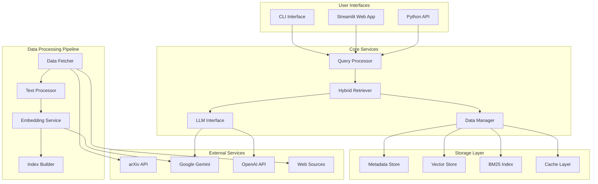
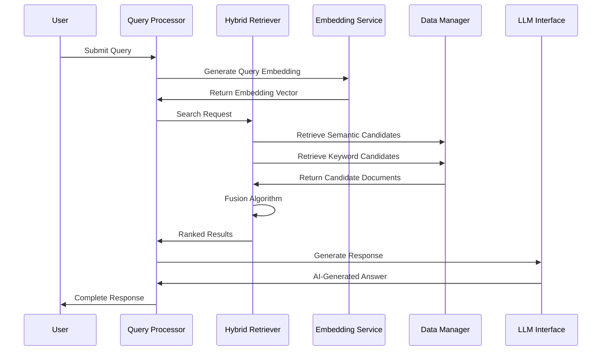
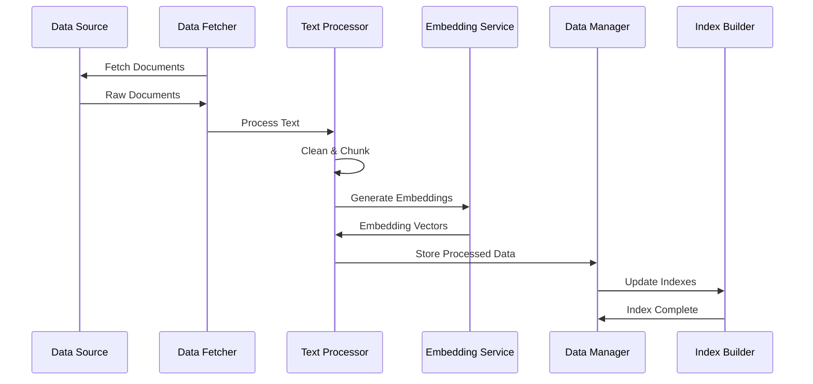
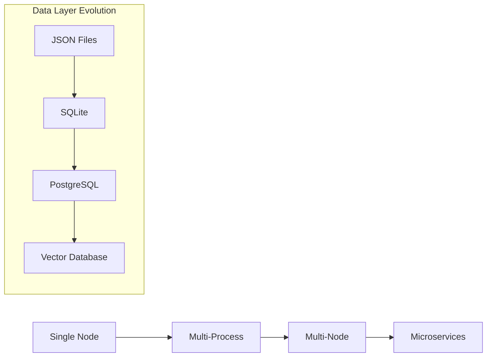

# System Architecture Overview

Research Assistant is built on a sophisticated, modular architecture designed for scalability, maintainability, and performance. This guide provides a comprehensive overview of the system's design philosophy and component interactions.

## 🏗️ Architecture Philosophy

The Research Assistant follows several key architectural principles derived from the `.instructions.md` guidelines:

### SOLID Principles
- **Single Responsibility**: Each component has a well-defined purpose
- **Open/Closed**: Extensible for new data sources and models
- **Liskov Substitution**: Interchangeable implementations (e.g., different LLM providers)
- **Interface Segregation**: Clean, focused interfaces between components
- **Dependency Inversion**: Abstract interfaces rather than concrete implementations

### Design Patterns
- **Strategy Pattern**: Pluggable retrieval algorithms and LLM providers
- **Factory Pattern**: Creation of embedders, retrievers, and LLM interfaces
- **Observer Pattern**: Event-driven data processing and updates
- **Adapter Pattern**: Integration with diverse external APIs

## 🎯 High-Level Architecture



## 🧩 Core Components

### 1. **Data Ingestion Pipeline**

The data ingestion system is responsible for collecting, processing, and indexing academic papers:

```python
# Key Files:
# - hybrid_search_rag/data_handling/resource_fetcher.py
# - scripts/continuous_fetch_with_dedup.py
```

**Components:**
- **Resource Fetcher**: Asynchronous data collection from arXiv and web sources
- **Text Processor**: Document cleaning, chunking, and preprocessing  
- **Deduplication**: Hash-based duplicate detection and removal
- **Metadata Extractor**: Paper title, authors, abstract, and citation information

**Key Features:**
- ⚡ Asynchronous processing with `asyncio` and `aiohttp`
- 🕷️ JavaScript-aware web scraping with Playwright
- 🔄 Continuous updates with deduplication
- 🛡️ Robust error handling and retry mechanisms

### 2. **Knowledge Representation**

The system converts raw text into searchable knowledge representations:

```python
# Key Files:
# - hybrid_search_rag/embedding_services/gemini_embedder.py
# - hybrid_search_rag/text_processing/nltk_processor.py
```

**Components:**
- **Text Chunking**: Sentence-boundary aware segmentation
- **Embedding Generation**: Dense vector representations using transformer models
- **Keyword Indexing**: Sparse BM25 index for term-based search
- **Metadata Indexing**: Structured information for filtering and sorting

**Supported Models:**
- 🧠 Google Gemini embeddings (`text-embedding-004`)
- 🤖 OpenAI embeddings (`text-embedding-3-large`)  
- 🌟 Cohere embeddings (`embed-english-v3.0`)
- 🤗 HuggingFace transformer models

### 3. **Hybrid Retrieval System**

The retrieval system combines multiple search strategies for optimal relevance:

```python
# Key Files:
# - hybrid_search_rag/retrieval_algorithm/hybrid_recommender.py
```

**Retrieval Methods:**
- **Semantic Search**: Vector similarity using cosine distance
- **Keyword Search**: BM25 ranking for term matching
- **Hybrid Fusion**: Reciprocal Rank Fusion (RRF) for combining results

**Algorithm:**
```python
def hybrid_search(query, top_k=5):
    # Semantic retrieval
    semantic_results = semantic_search(query_embedding, top_k)
    
    # Keyword retrieval  
    keyword_results = bm25_search(query_tokens, top_k)
    
    # Fusion
    fused_results = reciprocal_rank_fusion(
        semantic_results, 
        keyword_results,
        weights=[0.7, 0.3]
    )
    
    return fused_results[:top_k]
```

### 4. **Language Model Interface**

The LLM interface provides unified access to multiple language model providers:

```python
# Key Files:
# - hybrid_search_rag/llm_services/llm_interface.py
```

**Supported Providers:**
- 🟢 Google Gemini (Primary)
- 🔵 OpenAI GPT models
- ⚡ Groq (Fast inference)
- 🔶 Anthropic Claude
- 🏠 Custom endpoints

**Features:**
- 🔄 Automatic fallback between providers
- ⚙️ Configurable generation parameters
- 📏 Context window management
- 🎯 Prompt engineering and optimization

### 5. **Data Management Layer**

Centralized data persistence and retrieval:

```python
# Key Files:
# - hybrid_search_rag/data_handling/data_manager.py
```

**Storage Components:**
- **Metadata Store**: JSON-based document metadata
- **Vector Store**: NumPy arrays for embeddings (FAISS for large datasets)
- **BM25 Index**: Pickled Scikit-learn TF-IDF and BM25 objects
- **Cache Layer**: Request/response caching for performance

**Data Integrity:**
- ✅ Transactional updates
- 🔐 Hash-based integrity checking
- 🔄 Automatic index rebuilding
- 📊 Consistency validation

## 📊 Data Flow Architecture

### Query Processing Flow



### Data Ingestion Flow



## 🔧 Configuration Architecture

Configuration follows the centralized pattern specified in `.instructions.md`:

```python
# All configuration in hybrid_search_rag/config.py
```

**Configuration Layers:**
1. **Environment Variables**: API keys and sensitive data (`.env`)
2. **Config Constants**: Application parameters (`config.py`)
3. **Runtime Parameters**: User-specified options (CLI/API)
4. **Default Values**: Fallback configurations

**Key Configuration Categories:**
- 🔑 **API Keys & Authentication**
- 📁 **Data Storage Paths**
- 🧠 **Model Selection & Parameters**
- ⚡ **Performance & Rate Limiting**
- 📝 **Logging & Debugging**

## 🚀 Scalability Architecture

### Horizontal Scaling

**Current Architecture:**
- Single-node processing
- In-memory embeddings storage
- File-based metadata storage

**Scaling Path:**


### Performance Optimization

**Memory Management:**
- Lazy loading of embeddings
- Batch processing for large operations
- Memory-mapped file access
- Garbage collection optimization

**Concurrency:**
- Asyncio for I/O operations
- Thread pools for CPU-bound tasks
- Semaphores for rate limiting
- Lock-free data structures where possible

## 🛡️ Security Architecture

Following security principles from `.instructions.md`:

### Input Sanitization
- Query parameter validation
- URL safety checking
- Content filtering and cleaning
- Injection attack prevention

### API Security
- Environment-based key management
- HTTPS enforcement for external calls
- Request signing and validation
- Rate limiting and abuse prevention

### Data Privacy
- No storage of sensitive user data
- Configurable logging levels
- Optional query anonymization
- Secure credential handling

## 🧪 Testing Architecture

**Testing Pyramid:**
- **Unit Tests**: Individual component testing
- **Integration Tests**: Component interaction testing
- **End-to-End Tests**: Full pipeline testing
- **Performance Tests**: Load and stress testing

**Test Categories:**
- ✅ **Functional Testing**: Correctness of algorithms
- ⚡ **Performance Testing**: Speed and memory usage
- 🔧 **Integration Testing**: API and service interactions
- 🎯 **Evaluation Testing**: ML model performance metrics

## 📚 Extension Points

The architecture is designed for extensibility:

### Adding New Data Sources
```python
class CustomDataFetcher(DataFetcher):
    async def fetch_documents(self, query: str) -> List[Document]:
        # Implement custom fetching logic
        pass
```

### Adding New LLM Providers
```python
class CustomLLMProvider(LLMProvider):
    async def generate_response(self, prompt: str) -> str:
        # Implement custom LLM integration
        pass
```

### Adding New Retrieval Algorithms
```python
class CustomRetriever(BaseRetriever):
    def search(self, query: str, top_k: int) -> List[Document]:
        # Implement custom search algorithm
        pass
```

## 🔍 Monitoring & Observability

**Logging Strategy:**
- Structured logging with JSON format
- Component-specific log levels
- Performance metrics collection
- Error tracking and alerting

**Metrics Collection:**
- Query processing time
- Retrieval accuracy metrics
- API response times
- Memory and CPU usage

**Health Checks:**
- Component status monitoring
- API endpoint availability
- Data integrity validation
- Performance threshold alerts

## 🎯 Future Architecture Considerations

**Planned Enhancements:**
1. **Microservices Migration**: Breaking into independent services
2. **Vector Database Integration**: Dedicated vector storage (Pinecone, Weaviate)
3. **Real-time Updates**: Event-driven data pipeline
4. **Multi-tenant Support**: Isolated user environments
5. **Edge Deployment**: Distributed inference capabilities

---

This architecture provides a solid foundation for the Research Assistant while maintaining flexibility for future enhancements and scaling requirements. Each component is designed with the principles of maintainability, testability, and extensibility in mind.
