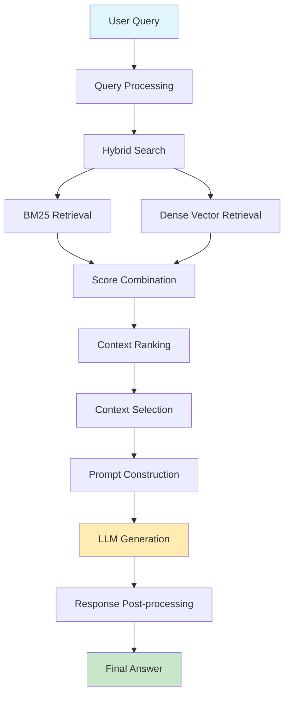

# RAG Pipeline

The Research Assistant's Retrieval-Augmented Generation (RAG) pipeline is the core component that enables intelligent information retrieval and response generation for academic research queries.

## Pipeline Overview

The RAG pipeline combines traditional information retrieval with modern language models to provide accurate, contextual responses backed by relevant academic sources.



## Pipeline Stages

### 1. Query Processing
- **Text normalization**: Clean and standardize input queries
- **Intent detection**: Identify query type (factual, comparative, analytical)
- **Query expansion**: Add relevant synonyms and academic terminology
- **Metadata extraction**: Extract keywords, topics, and filtering criteria

### 2. Hybrid Search Execution
The system employs a sophisticated hybrid search approach combining:

#### BM25 (Lexical Search)
- Traditional keyword-based retrieval
- Excellent for exact term matches
- Handles technical terminology effectively
- Fast execution for large corpora

#### Dense Vector Retrieval
- Semantic similarity matching using embeddings
- Captures contextual relationships
- Better for conceptual queries
- Uses pre-trained scientific embeddings

### 3. Score Combination & Ranking
- **Weighted fusion**: Combines BM25 and vector scores
- **Reciprocal rank fusion**: Merges ranking lists
- **Relevance scoring**: Applies domain-specific weights
- **Diversity promotion**: Ensures result variety

### 4. Context Selection
- **Relevance filtering**: Removes low-scoring results
- **Content deduplication**: Eliminates similar passages
- **Context window optimization**: Fits within LLM limits
- **Source diversification**: Balances different paper sources

### 5. Response Generation
- **Prompt engineering**: Constructs effective LLM prompts
- **Context injection**: Integrates retrieved passages
- **Generation parameters**: Controls creativity vs. accuracy
- **Citation formatting**: Maintains source attribution

## Implementation Details

### Core Components

#### RAGProcessor Class
```python
class RAGProcessor:
    def __init__(self, config):
        self.hybrid_search = HybridSearchEngine(config)
        self.llm_service = LLMService(config)
        self.context_ranker = ContextRanker()
        
    def process_query(self, query: str) -> RAGResponse:
        # Query processing pipeline
        processed_query = self.preprocess_query(query)
        
        # Hybrid retrieval
        search_results = self.hybrid_search.search(processed_query)
        
        # Context selection
        selected_context = self.select_context(search_results)
        
        # Response generation
        response = self.generate_response(query, selected_context)
        
        return response
```

#### Configuration Parameters
- **Retrieval settings**: Number of results, similarity thresholds
- **Fusion weights**: BM25 vs. vector search balance
- **Context limits**: Maximum tokens for LLM input
- **Generation parameters**: Temperature, max tokens, stop sequences

### Performance Optimizations

#### Caching Strategy
- **Query result caching**: Store frequent query results
- **Embedding caching**: Reuse computed embeddings
- **LLM response caching**: Cache similar responses
- **Index warming**: Pre-load frequently accessed data

#### Parallel Processing
- **Concurrent retrieval**: Run BM25 and vector search in parallel
- **Batch processing**: Handle multiple queries efficiently
- **Async operations**: Non-blocking I/O operations
- **Resource pooling**: Manage LLM API connections

## Quality Assurance

### Evaluation Metrics
- **Retrieval accuracy**: Precision@K, Recall@K, nDCG
- **Response quality**: Relevance, coherence, factuality
- **Citation accuracy**: Source attribution correctness
- **Latency metrics**: End-to-end response time

### Continuous Improvement
- **A/B testing**: Compare different pipeline configurations
- **User feedback**: Incorporate rating and correction data
- **Performance monitoring**: Track key metrics over time
- **Model updates**: Regular embedding and LLM model updates

## Error Handling

### Graceful Degradation
- **Fallback strategies**: Handle API failures gracefully
- **Partial results**: Return available information when possible
- **Error recovery**: Retry with adjusted parameters
- **User communication**: Clear error messages and suggestions

### Common Issues
- **No relevant results**: Suggest query refinements
- **API rate limits**: Implement backoff strategies
- **Context overflow**: Intelligent truncation and summarization
- **Citation gaps**: Handle missing or incomplete metadata

## Configuration Examples

### Basic Configuration
```yaml
rag_pipeline:
  retrieval:
    max_results: 20
    bm25_weight: 0.4
    vector_weight: 0.6
    min_score_threshold: 0.1
  
  context_selection:
    max_context_tokens: 4000
    diversity_threshold: 0.7
    max_sources: 8
  
  generation:
    model: "gpt-3.5-turbo"
    temperature: 0.1
    max_tokens: 1000
```

### Advanced Configuration
```yaml
rag_pipeline:
  query_processing:
    expand_queries: true
    extract_entities: true
    detect_intent: true
  
  hybrid_search:
    fusion_method: "reciprocal_rank_fusion"
    rerank_results: true
    boost_recent_papers: 1.2
  
  response_generation:
    include_uncertainty: true
    cite_sources: "inline"
    format_output: "markdown"
```

## Integration Points

### Data Pipeline Integration
- **Document ingestion**: Seamless integration with data collection
- **Index updates**: Real-time or batch index maintenance
- **Metadata enrichment**: Enhanced search capabilities

### User Interface Integration
- **Web interface**: Streamlit-based research dashboard
- **CLI integration**: Command-line query processing
- **API endpoints**: RESTful service integration

### Monitoring Integration
- **Logging**: Comprehensive operation logging
- **Metrics collection**: Performance and quality metrics
- **Alerting**: Error and performance threshold alerts

## Future Enhancements

### Planned Improvements
- **Multi-modal retrieval**: Support for figures and tables
- **Conversation context**: Multi-turn query handling
- **Personalization**: User-specific result customization
- **Real-time updates**: Live index updates for new papers

### Research Directions
- **Advanced fusion**: Neural fusion methods
- **Query understanding**: Better intent recognition
- **Result explanation**: Interpretable retrieval decisions
- **Adaptive learning**: Self-improving pipeline components
