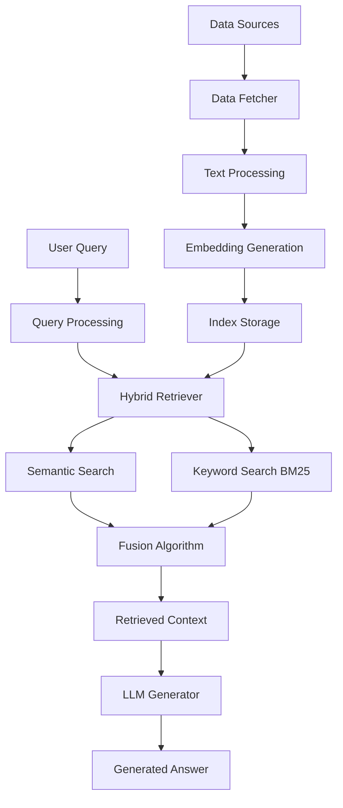

# Research Assistant Documentation

Welcome to the **Research Assistant** documentation! This comprehensive guide will help you understand, install, configure, and use the Research Assistant - a powerful Machine Learning-powered tool for academic research and information retrieval.

## 🌐 Try the Live Demo

**Interactive Web Interface:** [https://research-assistant-flx.streamlit.app/](https://research-assistant-flx.streamlit.app/)

Experience the full power of Research Assistant with our live web application featuring real-time search, analysis, and AI-powered insights.

## What is Research Assistant?

Research Assistant is an advanced **Retrieval Augmented Generation (RAG)** system that combines cutting-edge Natural Language Processing techniques with intelligent information retrieval to assist researchers, students, and academics in navigating and understanding complex academic literature.

### Key Features

🔍 **Hybrid Search Technology**
- Combines semantic (dense) and keyword (sparse) search using BM25 and transformer embeddings
- Advanced fusion algorithms for optimal relevance ranking

🤖 **AI-Powered Question Answering**
- Integration with state-of-the-art Large Language Models (LLMs)
- Context-aware answer generation based on retrieved academic papers

📚 **Multi-Source Data Integration**
- arXiv paper fetching and processing
- Web crawling capabilities with JavaScript rendering support
- Extensible architecture for adding new data sources

⚡ **High-Performance Architecture**
- Asynchronous processing for efficient data fetching
- Optimized vector similarity search
- Robust caching and deduplication mechanisms

🛠️ **Multiple Interfaces**
- Command-line interface (CLI) for power users
- Streamlit web application for interactive use
- RESTful API endpoints for integration

## Architecture Overview

The Research Assistant follows a modular architecture built around the RAG (Retrieval Augmented Generation) paradigm:

## Core Components

### 🏗️ **System Architecture**
- **RAG Pipeline**: Retrieval Augmented Generation workflow
- **Hybrid Search**: Combination of semantic and keyword-based retrieval
- **Data Flow**: Efficient processing from raw data to user answers

### 🧠 **NLP & Machine Learning**
- **Text Processing**: Advanced preprocessing with NLTK
- **Embeddings**: Google Gemini and other transformer-based models
- **LLM Integration**: Support for multiple language model providers

### 🔌 **API & Integration**
- **External APIs**: arXiv, web scraping, LLM services
- **Rate Limiting**: Intelligent request management
- **Authentication**: Secure API key management

### 📊 **Data Management**
- **Multi-source Data**: arXiv papers, web articles, PDFs
- **Storage**: Efficient metadata and embedding storage
- **Deduplication**: Hash-based duplicate detection

## Getting Started

Ready to dive in? Here's how to get started:

1. **[Installation](./getting-started/installation.md)** - Set up your development environment
2. **[Quick Start](./getting-started/quick-start.md)** - Get up and running in minutes
3. **[Configuration](./getting-started/configuration.md)** - Configure API keys and settings
4. **[First Query](./getting-started/first-query.md)** - Run your first research query

## Documentation Structure

This documentation is organized into several main sections:

- **🚀 Getting Started**: Installation, setup, and basic usage
- **🏗️ System Architecture**: Deep dive into the system design
- **🧠 NLP & Machine Learning**: ML concepts and implementations
- **🔌 API & Integration**: External API usage and integration patterns
- **📊 Data Management**: Data sources, processing, and storage
- **🖥️ User Interfaces**: CLI, web app, and API interfaces
- **⚡ Performance & Scalability**: Optimization and scaling strategies
- **🧪 Testing & Evaluation**: Quality assurance and evaluation metrics
- **🛠️ Development**: Contributing and development guidelines
- **📚 Reference**: Complete API reference and troubleshooting

## Contributing

Research Assistant is an open-source project that welcomes contributions! Check out our [Contributing Guide](./development/contributing.md) to learn how you can help improve the project.

## Support

Need help? Here are your options:

- 📖 **Documentation**: Start with this comprehensive guide
- 🐛 **Issues**: Report bugs or request features on GitHub
- 💬 **Discussions**: Join the community discussions
- 📧 **Contact**: Reach out to the development team

---

*Built with ❤️ for the research community*
